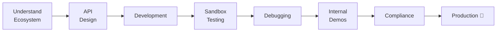
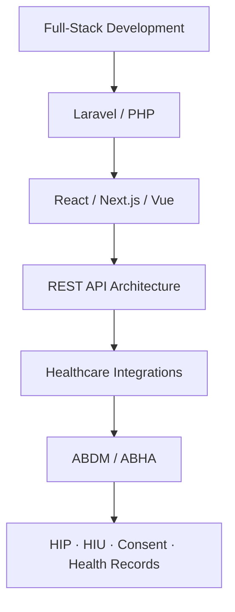

 

 

---

## 👋 About Me

I build **scalable web applications, healthcare platforms, APIs and integrations**.
Right now I'm deep into **healthcare tech, ABDM integrations, Laravel apps and modern web/mobile products**.

> 💡 *Building software is not just about writing code. It's about understanding the problem, designing the right solution, and making it work reliably.*

---

## 🏥 ABDM Integration Experience

Hands-on implementation of **Ayushman Bharat Digital Mission (ABDM) M1, M2 & M3**, across the full integration lifecycle.

<table>
<tr>
<td width="33%" valign="top">

### 🟢 M1 · ABHA
- ABHA creation
- ABHA verification
- Patient workflows
- ABHA linking

</td>
<td width="33%" valign="top">

### 🔵 M2 · HIP
- Health record workflows
- Care context linking
- HIP workflows
- Health information sharing

</td>
<td width="33%" valign="top">

### 🟣 M3 · HIU
- Consent workflows
- Health information exchange
- HIU workflows
- Consent-based data access

</td>
</tr>
</table>

### 🛣️ Integration Journey · ~4–6 months

Work included studying ABDM specs, building APIs and workflows, end-to-end testing, troubleshooting integration issues, and refining through multiple internal testing and demo cycles.

`ABDM` `ABHA` `HIP` `HIU` `Consent Management` `Health Records` `Care Contexts` `FHIR` `Healthcare APIs` `Digital Health`

---

## 🛠️ Tech Stack

<b>📋 Full breakdown</b>

 

| Category | Technologies |
|---|---|
| **Backend** | PHP, Laravel, FilamentPHP, Node.js, Express.js, REST APIs |
| **Frontend** | React, Next.js, Vue.js, React Native, Tailwind CSS, Livewire |
| **Database** | MySQL, PostgreSQL, MongoDB |
| **Healthcare** | ABDM, ABHA, HIP, HIU, FHIR, Healthcare Integrations |
| **DevOps** | Linux, Apache, Nginx, Docker, PM2, CI/CD, Cloud Deployment |
| **Other** | WebSockets, API Integrations, JWT, RBAC, OAuth, Git |

---

## 🚀 What I Build

<table>
<tr>
<td>🏥 Hospital Management Systems</td>
<td>🩺 EMR / HMIS Platforms</td>
<td>🔗 ABDM & ABHA Integrations</td>
</tr>
<tr>
<td>🔌 REST API Integrations</td>
<td>📊 Admin Panels & Business Apps</td>
<td>🌐 SaaS Applications</td>
</tr>
<tr>
<td>📱 React Native Apps</td>
<td>⚡ Real-time Applications</td>
<td>☁️ Cloud Deployments</td>
</tr>
</table>

---

## 🧭 Areas of Expertise

---

## 📚 Currently Exploring

`🔬 Healthcare Interoperability` `🧬 FHIR & Data Standards` `🏛️ ABDM Ecosystem` `🤖 AI in Healthcare` `📈 Scalable SaaS Architecture` `☁️ Cloud & System Design`

---

## 📊 GitHub Stats

---

## 🤝 Let's Connect

Working on any of these? Let's talk.

**ABDM / ABHA integration · Healthcare / HMIS / EMR · Laravel / PHP · Healthcare APIs · Digital Health platforms**

